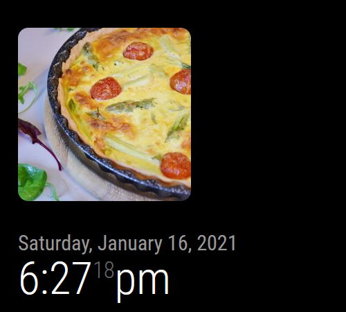

# MMM-Quiche-Holder
A MagicMirror² module for displaying a photo of a delicious quiche from [https://quiche-holder.briandady.com]().



## Installation

1. Download the Module

```
cd ~/MagicMirror/modules
git clone git@github.com:totallyquiche/MMM-Quiche-Holder.git
```

2. Add the Module to your MagicMirror² config

```
modules: [
    {
        module: "MMM-Quiche-Holder",
        position: "top_right"
    }
]
```

## Configuration

`MMM-Quiche-Holder` accepts the following config options:

| Config Option | Description | Default Value |
|---|---|---|
|`height`|The desired height of the image in `px`.|`150`|
|`width`|The desired width of the image in `px`.|`150`|
|`rounded`|Whether the corners of the image should be rounded or squared off.|`false`|
|`borderRadius`|Determines how rounded the corners of the image should be, in `px`. Does nothing if `rounded` is set to `false`.|`25`|

### Usage

```
modules: [
    {
        module: "MMM-Quiche-Holder",
        position: "top_right",
        config: {
            height: 200,
            width: 200,
            rounded: true,
            borderRadius: 100
        }
    }
]
```